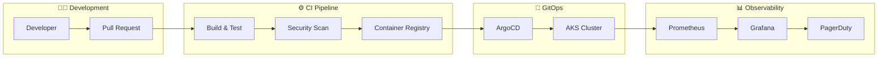
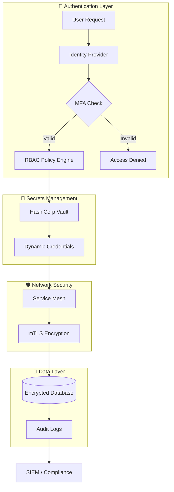

<!--
  ╔═══════════════════════════════════════════════════════════════════════════╗
  ║  README 2026 - Claudio Botelho | Senior DevSecOps & Cloud Architect       ║
  ╚═══════════════════════════════════════════════════════════════════════════╝
-->

<!-- HERO SECTION -->
<div align="center">


<!-- TAGLINE -->
### Engineering secure, scalable infrastructure that accelerates release velocity.

<br/>

<!-- QUICK STATS BADGES -->
[](https://github.com/ClaudioBotelhOSB)
&nbsp;
[](https://github.com/ClaudioBotelhOSB)
&nbsp;
[](https://icpc.global/)

<br/>

<!-- SOCIAL LINKS -->

[](https://www.linkedin.com/in/claudiosb/)
[](mailto:botelho.claudiosb@gmail.com)
[](https://github.com/ClaudioBotelhOSB)

</div>

<br/>

---

<!-- ABOUT ME - Business First -->
## Who I Am

```text
DevSecOps Engineer × Cloud Architect × Problem Solver
```

I am a **Senior DevSecOps Engineer** and **Cloud Architect** delivering expertise in **Multi-Cloud Architecture** (AWS/Azure), **Kubernetes Orchestration**, and **Zero-Trust Security Automation**. I engineer resilient, cost-optimized infrastructures that are secure by design and scale seamlessly under peak loads.

Leveraging a rigorous background in **competitive programming** (ICPC International Competitor), I apply algorithmic problem-solving to eliminate bottlenecks, optimize resource utilization, and architect high-performance data systems.

> **I do not merely deploy infrastructure—I engineer automated platforms that slash operational overhead and accelerate business delivery.**

<br/>

---

<!-- WHAT I SOLVE - Value Proposition -->
## What I Solve

### For CTOs & Engineering Leaders

- **Sluggish Deployment Cycles?** → I engineer robust CI/CD pipelines that slash release times from days to minutes.
- **Runaway Cloud Expenses?** → I implement strategic FinOps frameworks and infrastructure right-sizing, driving down operational costs by 30-50%.
- **Vulnerable Security Posture?** → I architect Zero-Trust environments and automate compliance (SOC2, ISO27001), rendering infrastructure secure by default.
- **Critical Scaling Bottlenecks?** → I design resilient, auto-scaling Kubernetes clusters capable of seamlessly absorbing 10x traffic surges.

<br/>

### For Founders & Startups

- **Speed to Market with Reliability?** → I deliver battle-tested, production-ready infrastructure from day one.
- **Operational Chaos in Scaling Teams?** → I establish Internal Developer Platforms (IDP) that empower developers with autonomy while enforcing strict architectural guardrails.
- **Due Diligence Readiness?** → I forge enterprise-grade security postures and comprehensive documentation to confidently satisfy investor scrutiny.

<br/>

---

<!-- EXPERTISE DOMAINS -->
## Core Expertise

<div align="center">

| Domain | Technologies | Focus |
|:------:|:------------|:------|
| **Cloud & Infrastructure** |      | Multi-cloud architecture, IaC, Landing Zones, Cost Optimization |
| **Container Orchestration** |     | AKS/EKS/GKE, GitOps, Service Mesh, Platform Engineering |
| **DevSecOps & Security** |     | Zero Trust, Secrets Management, Vulnerability Scanning, Compliance Automation |
| **CI/CD & Automation** |     | Pipeline as Code, Blue/Green & Canary Deployments, Configuration Management |
| **Observability** |     | SLI/SLO, Distributed Tracing, Log Aggregation, Alerting |
| **Programming** |     | Automation Scripts, CLI Tools, Infrastructure Tooling, API Development |

</div>

<br/>

---

<!-- CERTIFICATIONS & CREDENTIALS -->
## Certifications & Credentials

<div align="center">

| Certification | Status |
|:-------------:|:------:|
|  | `In Progress (Target: Q4 2026)` |
|  | `In Progress (Target: Q3 2026)` |
| -0078D4?style=for-the-badge&logo=microsoftazure&logoColor=white) | `Hands-on Expertise` |
|  | `Hands-on Expertise` |

<br/>

**Competitive Programming Background:**
**ICPC International Collegiate Programming Contest** — Developed strong algorithmic problem-solving skills that I actively apply to structural optimization and complex infrastructure challenges.

</div>

<br/>

---

<!-- FEATURED WORK -->
## Featured Work

> **Infrastructure projects often lack visual appeal, but here is how I drive measurable business impact:**

### Multi-Cloud Kubernetes Platform
**Business Challenge:** Manual deployment workflows resulting in brittle, 4-hour release cycles and zero operational visibility.
**Architectural Solution:** Engineered a GitOps-driven Internal Developer Platform on AKS, leveraging ArgoCD for continuous delivery, Prometheus for observability, and automated security scanning.



**Business Impact:**
- Release Cycle Time: **4 hours → 15 minutes**
- Deployment Variance/Failures: **-80%**
- Mean Time to Recovery (MTTR): **-65%**

---

### Zero Trust Security Implementation
**Business Challenge:** Flat network topology, decentralized credential management, and critical compliance vulnerabilities.
**Architectural Solution:** Spearheaded network segmentation and implemented HashiCorp Vault for dynamic secrets management, establishing a comprehensive Zero-Trust architecture with automated compliance validation.



**Business Impact:**
- Security Incidents: **-90%**
- Audit Preparation Overhead: **3 weeks → 2 days**
- Compliance Milestones: **SOC2 Type II Achieved**

---

### 🚀 Coming Soon: Azimuth (B2B SaaS Platform)
🚀 Coming Soon: Azimuth (Consumer SaaS)
As the Creator & Sole Architect, I engineered a predictive productivity app designed to help neurodivergent and neurotypical users translate their personal energy constraints into sustainable performance. Built entirely from scratch, Azimuth operates as a live benchmark of my engineering standards—rigorously applying Cloud Native architecture for seamless B2C scalability and Zero Trust security to protect highly sensitive user data.


<br/>

---

<!-- SERVICES / HOW I WORK -->
## How I Work

<div align="center">

| Engagement Model | Best For |
|:----------------:|:---------|
| **Consulting** | Strategic architecture reviews, vulnerability assessments, and cloud migration roadmaps. |
| **Fractional DevOps/Platform Lead** | Executive-level platform strategy for startups seeking senior expertise without the full-time overhead. |
| **Project-Based** | Targeted execution of mission-critical tasks: advanced CI/CD pipelines, K8s cluster design, and compliance automation. |
| **Staff Augmentation** | Embedded senior technical leadership to supercharge high-impact engineering initiatives. |

<br/>

### Currently Available for:

```diff
+ B2B Contracts / High-Impact Consulting Projects
+ Staff Augmentation (Remote, Worldwide)
+ Technical Advisory & Fractional Lead Roles
```

</div>

<br/>

---

<!-- CALL TO ACTION -->
<div align="center">

## Let's Engineer Your Next Strategic Advantage

<br/>

<!-- 🚨 ACTION REQUIRED: UPDATE CALL TO ACTION LINKS -->
[](https://YOUR_CALENDLY_LINK_HERE_🚨)
&nbsp;&nbsp;
[](mailto:YOUR_EMAIL_HERE_🚨)
&nbsp;&nbsp;
[](https://YOUR_LINKEDIN_HERE_🚨)

<br/>

**"Infrastructure should be a business accelerator, not an operational bottleneck."**

</div>

<br/>

---

<!-- GITHUB STATS - Opcional -->
<details>
<summary><b>GitHub Analytics</b></summary>
<br/>
<div align="center">


&nbsp;


<br/><br/>


</div>
</details>

<!-- DETAILED TECH STACK - Expandable -->
<details>
<summary><b>Full Technology Stack</b></summary>
<br/>

<div align="center">

#### Cloud Platforms
<p>

</p>

#### Infrastructure as Code
<p>

</p>

#### CI/CD & DevOps
<p>

</p>

#### Programming & Scripting
<p>

</p>

#### Observability & Monitoring
<p>

</p>

#### Databases
<p>

</p>

</div>
</details>

<br/>

---

<div align="center">


</div>
