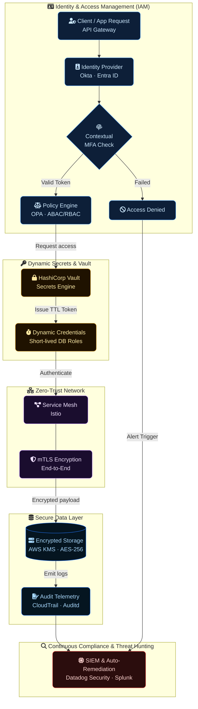

<!-- HERO SECTION -->
<div align="center">

<a href="https://github.com/ClaudioBotelhOSB">
  
</a>

<!-- TAGLINE -->
### Engineering secure, scalable infrastructure that accelerates release velocity.

<br/>

<!-- QUICK STATS BADGES -->
[](https://github.com/ClaudioBotelhOSB)
&nbsp;
[](https://icpc.global/)

<br/>

<!-- SOCIAL LINKS -->

[](https://www.linkedin.com/in/claudiosb/)
[](mailto:botelho.claudiosb@gmail.com)
[](https://github.com/ClaudioBotelhOSB)

</div>

<br/>

---

<!-- ABOUT ME - Business First -->
## 👤 Who I Am

```text
DevSecOps Engineer × Cloud Architect × Problem Solver
```

I am a **Senior DevSecOps Engineer** and **Cloud Architect** delivering expertise in **Multi-Cloud Architecture** (AWS/Azure), **Kubernetes Orchestration**, and **Zero-Trust Security Automation**. I engineer resilient, cost-optimized infrastructures that are secure by design and scale seamlessly under peak loads.

Leveraging a rigorous background in *competitive programming* (ICPC International Competitor), I apply algorithmic problem-solving to eliminate bottlenecks and architect high-performance infrastructures. *Furthermore, I bring a strong data-engineering approach to DevSecOps*, building custom telemetry and automated incident-response pipelines that transform raw database metrics and access logs into actionable business intelligence and automated threat hunting.

> **I do not merely deploy infrastructure—I engineer automated platforms that slash operational overhead and accelerate business delivery.**

<br/>

---

<!-- WHAT I SOLVE - Value Proposition -->
## 🎯 What I Solve

### For CTOs & Engineering Leaders

- **Blind Spots in Business & App Metrics?** → I engineer custom data pipelines (Python/SQL) that extract and process end-to-end application telemetry, turning raw database queries into real-time business intelligence (usage volume, data flows, and user behavior).
- **Slow Incident Response & Forensics?** → I develop automated Threat Hunting tools that ingest a single anomaly alert and instantly compile comprehensive forensic reports—correlating user activity, geolocating IPs, cross-referencing global blacklists, and isolating malicious actors in seconds.
- **Sluggish Deployment Cycles?** → I engineer robust CI/CD pipelines that slash release times from days to minutes.
- **Runaway Cloud Expenses?** → I implement strategic FinOps frameworks and infrastructure right-sizing, driving down operational costs by 30-50%.
- **Vulnerable Security Posture?** → I architect Zero-Trust environments and automate compliance (SOC2, ISO27001), rendering infrastructure secure by default.
- **Critical Scaling Bottlenecks?** → I design resilient, auto-scaling Kubernetes clusters capable of seamlessly absorbing 10x traffic surges.

<br/>

### For Founders & Startups

- **Speed to Market with Reliability?** → I deliver battle-tested, production-ready infrastructure from day one.
- **Operational Chaos in Scaling Teams?** → I establish Internal Developer Platforms (IDP) that empower developers with autonomy while enforcing strict architectural guardrails.
- **Due Diligence Readiness?** → I forge enterprise-grade security postures and comprehensive documentation to confidently satisfy investor scrutiny.

<br/>

---

<!-- EXPERTISE DOMAINS -->
## ⚡ Core Expertise

<div align="center">

| Domain | Technologies | Focus |
|:------:|:------------|:------|
| **Cloud & Infrastructure** |      | Multi-cloud architecture, IaC, Landing Zones, Cost Optimization |
| **Container Orchestration** |     | AKS/EKS/GKE, GitOps, Service Mesh, Platform Engineering |
| **DevSecOps & Security** |     | Zero Trust, Secrets Management, Vulnerability Scanning, Compliance Automation |
| **CI/CD & Automation** |     | Pipeline as Code, Blue/Green & Canary Deployments, Configuration Management |
| **Observability** |     | SLI/SLO, Distributed Tracing, Log Aggregation, Alerting |
| **Programming** |     | Automation Scripts, CLI Tools, Infrastructure Tooling, API Development |

</div>

<br/>

---

<!-- FEATURED WORK -->
## 🚀 Featured Work

> **Infrastructure projects often lack visual appeal, but here is how I drive measurable business impact:**

### Multi-Cloud Kubernetes Platform
**Business Challenge:** Manual deployment workflows resulting in brittle, 4-hour release cycles and zero operational visibility.
**Architectural Solution:** Engineered a GitOps-driven Internal Developer Platform on AKS, leveraging ArgoCD for continuous delivery, Prometheus for observability, and automated security scanning.

```mermaid
flowchart TD
    classDef devStyle fill:#0d1f38,stroke:#58a6ff,color:#cae6ff,rx:8;
    classDef ciStyle fill:#0d1f0d,stroke:#3fb950,color:#ccffd4,rx:8;
    classDef secStyle fill:#2b0d0d,stroke:#f85149,color:#ffd0cc,rx:8;
    classDef regStyle fill:#1a0d2e,stroke:#bc8cff,color:#eddeff,rx:8;
    classDef gitopsStyle fill:#0d1f38,stroke:#79c0ff,color:#cae6ff,rx:8;
    classDef cloudStyle fill:#051520,stroke:#1f6feb,color:#a5d6ff,rx:8;
    classDef obsStyle fill:#1f1200,stroke:#d29922,color:#ffe8a0,rx:8;
    classDef alertStyle fill:#1f0a00,stroke:#db6d28,color:#ffd8b0,rx:8;

    subgraph DEV["fa:fa-laptop-code Developer Workflow"]
        direction LR
        A["fa:fa-user-circle Engineer\nVS Code · Copilot"] -->|"git push"| B["fa:fa-code-branch Pull Request\nBranch Protection"]
    end

    subgraph CI["fa:fa-cogs CI Pipeline · GitHub Actions"]
        direction LR
        C["fa:fa-hammer Build & Test\npytest · Jest"] -->|"tests pass"| D["fa:fa-shield-alt SAST & SCA\nSonarQube · Trivy"]
        D -->|"vuln score OK"| E["fa:fa-file-contract Policy Gate\nOPA Conftest"]
    end

    subgraph REG["fa:fa-archive Artifact Management"]
        direction LR
        F["fa:fa-docker Container Registry\nAzure ACR · AWS ECR"] -->|"sign & attest"| G["fa:fa-lock Image Signing\nCosign"]
    end

    subgraph GITOPS["fa:fa-sync GitOps Control Plane"]
        direction LR
        H["fa:fa-git-alt Config Repository\nHelm Charts · Kustomize"] -->|"PR merged → reconcile"| I["fa:fa-redo ArgoCD\nApp of Apps"]
    end

    subgraph CLOUD["fa:fa-cloud Multi-Cloud Kubernetes Layer"]
        direction LR
        J["fa:fa-microsoft AKS\nAzure"] --- L["fa:fa-network-wired Service Mesh\nIstio mTLS"]
        K["fa:fa-aws EKS\nAWS"] --- L
    end

    subgraph OBS["fa:fa-chart-line Observability Platform"]
        direction LR
        M["fa:fa-tachometer-alt Metrics\nPrometheus"] --> P["fa:fa-desktop Dashboards\nGrafana Cloud"]
        N["fa:fa-sitemap Tracing\nOpenTelemetry"] --> P
        O["fa:fa-list Logging\nFluentd · Loki"] --> P
    end

    subgraph INC["fa:fa-bell Incident & Response"]
        direction LR
        Q["fa:fa-exclamation-triangle Alerting\nPagerDuty"] -->|"trigger runbook"| R["fa:fa-wrench Auto-Remediation\nAnsible"]
    end

    B -->|"webhook trigger"| C;
    E -->|"push verified image"| F;
    G -->|"CI pipeline commits new digest"| H;
    I -->|"apply manifests"| J;
    I -->|"apply manifests"| K;
    L --> M;
    L --> N;
    L --> O;
    P -->|"threshold breach"| Q;

    class A,B devStyle;
    class C ciStyle;
    class D,E,G secStyle;
    class F regStyle;
    class H,I gitopsStyle;
    class J,K,L cloudStyle;
    class M,N,O,P obsStyle;
    class Q,R alertStyle;
```



**Business Impact:**
- Release Cycle Time: **4 hours → 15 minutes**
- Deployment Variance/Failures: **-80%**
- Mean Time to Recovery (MTTR): **-65%**

---

### Zero Trust Security Implementation
**Business Challenge:** Flat network topology resulting in lateral movement risks, decentralized credential sprawl, and critical audit vulnerabilities blocking enterprise compliance.

**Architectural Solution:** Engineered a comprehensive Zero-Trust architecture by enforcing strict network micro-segmentation, integrating HashiCorp Vault for dynamic secrets, and building automated threat-hunting pipelines to guarantee continuous SOC2 compliance and real-time anomaly detection.



**Business Impact:**
- Security Incidents: **-90%**
- Audit Preparation Overhead: **3 weeks → 2 days**
- Compliance Milestones: **SOC2 Type II Achieved**

---

### 🚀 Coming Soon: Azimuth (B2B SaaS Platform)
As the Creator & Sole Architect, I engineered a predictive productivity app designed to help neurodivergent and neurotypical users translate their personal energy constraints into sustainable performance. Built entirely from scratch, Azimuth operates as a live benchmark of my engineering standards—rigorously applying Cloud Native architecture for seamless B2C scalability and Zero Trust security to protect highly sensitive user data.


<br/>

---

<!-- SERVICES / HOW I WORK -->
## How I Work

<div align="center">

| Engagement Model | Best For |
|:----------------:|:---------|
| **Consulting** | Strategic architecture reviews, vulnerability assessments, and cloud migration roadmaps. |
| **Fractional DevOps/Platform Lead** | Executive-level platform strategy for startups seeking senior expertise without the full-time overhead. |
| **Project-Based** | Targeted execution of mission-critical tasks: advanced CI/CD pipelines, K8s cluster design, and compliance automation. |
| **Staff Augmentation** | Embedded senior technical leadership to supercharge high-impact engineering initiatives. |

<br/>

### Currently Available for:

```diff
+ B2B Contracts / High-Impact Consulting Projects
+ Staff Augmentation (Remote, Worldwide)
+ Technical Advisory & Fractional Lead Roles
```

</div>

<br/>

---

<!-- CALL TO ACTION -->
<div align="center">

## Let's Engineer Your Next Strategic Advantage

<br/>

&nbsp;&nbsp;
[](mailto:botelho.claudiosb@gmail.com)
&nbsp;&nbsp;
[](https://www.linkedin.com/in/claudiosb/)

<br/>

**"Infrastructure should be a business accelerator, not an operational bottleneck."**

</div>

<br/>

---
<!-- DETAILED TECH STACK - Expandable -->
<details>
<summary><b>Full Technology Stack</b></summary>
<br/>

<div align="center">

#### Cloud Platforms
<p>

</p>

#### Infrastructure as Code
<p>

</p>

#### CI/CD & DevOps
<p>

</p>

#### Programming & Scripting
<p>

</p>

#### Observability & Monitoring
<p>

</p>

#### Databases
<p>

</p>

</div>
</details>

<br/>

---

<div align="center">


</div>
